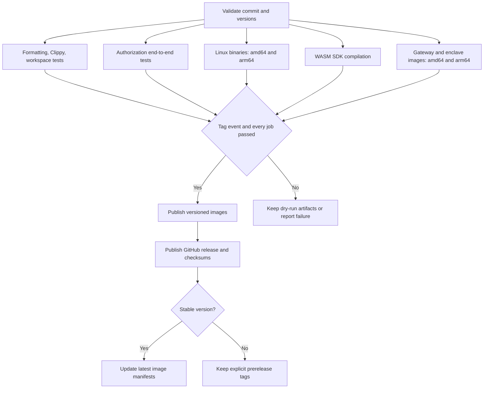

# Release process

Release one reviewed commit with matching source, package versions, binaries, and container images.
Keep published tags and affected release history available for audit.

The current security remediation is unreleased.
Keep changes local until every supplied report finding has a reviewed resolution and regression evidence.
Do not push, merge, tag, or publish this remediation while that gate remains incomplete.
See the [finding inventory](../docs/AUTHORIZATION.md#finding-inventory).

## Prepare the release

1. Resolve every supplied finding and record the regression evidence for each resolution.
2. Complete local review and tests before pushing the remediation branch.
3. Update the workspace version and each package version in the release pull request.
4. Update `Cargo.lock`, consumer examples, and migration instructions in the same pull request.
5. Explain incompatible API changes and the verified finding resolutions in the release notes.
   Commit those notes at `docs/releases/VERSION.md`; the workflow requires and publishes that exact file.
6. Run normal continuous integration (CI), including end-to-end tests, on the reviewed change.
7. Check the Release workflow dry run for the pull request commit.
8. Merge the reviewed pull request after the required checks pass.

Release `0.4.0` directly after review and validation because the update changes the client, gateway, and enclave protocol.
The final release scope must include every supplied report finding.
Use the pull request workflow dry run to validate the release before tagging.
Closing those findings does not by itself establish production readiness.
KMS recovery still uses IAM authorization without Nitro `Recipient` attestation; see the [current KMS trust boundary](../docs/KMS.md#current-trust-boundary).

Upgrade the client, gateway, and enclave together.
Archive the stopped services' legacy database and enclave state, then configure fresh state locations.
Legacy records can fail bulk restoration and administrative queries; do not mix them with new authorized sessions.
Create new authorized sessions after the upgrade; legacy sessions lack the required manifest and registration proofs.
Preserve the archive for audit instead of deleting or overwriting it.
Verify the signed participant roster and aggregate keys before funding any new contract.

## Publish a reviewed commit

Confirm that every finding is closed with review and regression evidence before using these commands.
Replace `REVIEWED_MERGE_SHA` with the full commit SHA approved for release.
The commands below create and publish a signed tag; execute them only when the release is authorized.

```bash
RELEASE_VERSION=0.4.0
RELEASE_COMMIT=REVIEWED_MERGE_SHA

git fetch origin master --tags
git show --stat "$RELEASE_COMMIT"
git merge-base --is-ancestor "$RELEASE_COMMIT" origin/master
git tag -s "v$RELEASE_VERSION" "$RELEASE_COMMIT" -m "Release v$RELEASE_VERSION"
git verify-tag "v$RELEASE_VERSION"
git push origin "refs/tags/v$RELEASE_VERSION"
```

The workflow requires the tag version to match all committed package versions.
The workflow builds the exact tagged commit and makes no version commits.
See the [checkout reference behavior](https://github.com/actions/checkout#usage) for the `ref` input.

## Workflow gates

| Event | Source | Publication |
| --- | --- | --- |
| Pull request | Pull request head commit | Dry run; artifacts only |
| Manual dispatch | Selected event commit | Dry run; artifacts only |
| Push of `vMAJOR.MINOR.PATCH-PRERELEASE` | Tagged commit | Prerelease and versioned images after every gate; no latest aliases |
| Push of `vMAJOR.MINOR.PATCH` | Tagged commit | Stable release and versioned images after every gate; then latest aliases |



Build jobs have read access and do not receive registry credentials.
Only publication jobs receive write permissions.
The authorization job tests the same commit against a gateway and three development enclave processes before publication.
GitHub applies job dependencies before publication conditions. See [workflow job dependencies](https://docs.github.com/en/actions/reference/workflows-and-actions/workflow-syntax#jobsjob_idneeds).

The workflow checks builds and tests; it does not determine whether every report finding is closed or Nitro hardware acceptance passed.
Reviewers must enforce that release gate before a tag is pushed.

The workflow validates WASM library compilation; it does not publish JavaScript bindings.
The workflow does not publish packages to crates.io.

## Verify the published release

1. Confirm the workflow summary identifies the reviewed commit.
2. Confirm both gateway and enclave archives exist for each architecture.
3. Compare each archive against the published `SHA256SUMS` file.
4. Compare the `SOURCE-*.txt` files against the reviewed commit.
5. Confirm each versioned container manifest contains amd64 and arm64 images.
6. Confirm the published notes match the reviewed `docs/releases/0.4.0.md` file.
7. Confirm GitHub identifies `0.4.0` as the latest stable release and registry latest aliases point to its images.

If an artifact or publication job fails, investigate that job before retrying publication.
Do not move the existing tag to another commit.
Use a new version for corrected source or replacement release artifacts.

## Validate the Nitro deployment

1. Test the measured enclave images with their provisioned gateway verifier and KMS policy on actual Nitro hardware.
2. Verify the final image signatures and distribute trusted PCR measurements to the gateway and SDK consumers.
3. Reject an unknown gateway credential, changed KMS endpoint, debug enclave, stale attestation, and substituted recipient key.
4. Verify authorized keygen, complete-batch approval, standalone signing, and recovery after gateway and enclave restart.
5. Record the image digests, PCR measurements, KMS policy, tested commit, and results.
6. Complete the release workflow dry run on the reviewed `0.4.0` commit.
7. Tag and publish that reviewed commit after release approval.

Use explicit image and SDK versions throughout acceptance.
The existing `latest` alias may still identify an affected old version until `0.4.0` is published.
Do not deploy an unversioned alias during this migration.


## Mark affected releases as DO NOT USE

Keep existing tags, releases, assets, and original notes.
A deprecation notice preserves the evidence users need to identify an affected build.

1. List published releases and identify the versions affected by the report.
2. Save each affected release's original notes locally.
3. Prepend a `DO NOT USE` notice to the saved notes.
4. State the affected authorization behavior and link to the remediation or migration instructions.
5. If a replacement is published, identify its exact version and remaining limitations.
6. Review the complete replacement notes before updating the release.

Use the following commands for each reviewed, affected tag:

```bash
AFFECTED_TAG=v0.3.5
NOTES_FILE=/tmp/keymeld-affected-release-notes.md

gh release view "$AFFECTED_TAG" --repo tee8z/keymeld --json body --jq .body > "$NOTES_FILE"
```

Edit `NOTES_FILE` to prepend the notice and preserve the original notes.
Then apply the reviewed title and notes:

```bash
gh release edit "$AFFECTED_TAG" --repo tee8z/keymeld \
  --title "DO NOT USE — KeyMeld $AFFECTED_TAG" \
  --notes-file "$NOTES_FILE" --latest=false --verify-tag
```

The [GitHub CLI release editor](https://cli.github.com/manual/gh_release_edit) updates release metadata without changing the Git tag.
If GitHub rejects an update, retain the release and publish the notice through an available repository security notice.
Do not delete or retag the affected version to bypass that restriction.

No pre-0.4 rollback target resolves these findings. Stop the service if `0.4.0` cannot pass acceptance; preserve the archived state.
Preserve failed release history and publish corrective changes under a new version.

## Withdraw affected registry versions

Apply registry withdrawal only to affected package versions that were actually published.
Git tags and GitHub releases do not prove that a crates.io package exists.

1. Verify the package name and published version on crates.io.
2. Record the affected versions and check which consumers still depend on them.
3. Publish a registry security advisory or migration notice for those consumers.
4. If withdrawal is authorized, yank each confirmed affected version individually.

```bash
# Example only: first confirm this package version exists and is affected.
cargo yank keymeld-sdk --version 0.3.5 --registry crates-io
```

Yanking prevents normal dependency resolution from selecting an affected version.
Existing lockfiles and direct downloads can still use that version.
A yank does not remove package data. See the [Cargo yank documentation](https://doc.rust-lang.org/cargo/commands/cargo-yank.html).

Treat withdrawal as a best-effort measure and update consumer dependencies explicitly.
If the registry rejects the operation, preserve the error and use the security notice to direct users to remediation.
Keep versioned container images available for audit, and remove affected versions from deployment recommendations.
