# KeyMeld 🔐

[](https://www.rust-lang.org)
[](LICENSE)
[](https://github.com/bitcoin/bips/blob/master/bip-0327.mediawiki)

> ⚠️ **Not audited - use with caution**

Distributed MuSig2 Bitcoin signing via AWS Nitro Enclaves using a secure 2-phase workflow.

## Motivation

### The Challenge
MuSig2 as a protocol has two key constraints that make it difficult to use in multi-party setups:

- **Two rounds of communication**: All participants must come online and communicate in two distinct rounds to create an aggregated signature
- **Known participants**: All participant public keys must be known at the start of the process
- **Liveness requirements**: Especially challenging in mobile or distributed scenarios where participants may have unreliable connectivity or may never come back online after joining

### KeyMeld's Solution
KeyMeld addresses these challenges by delegating the coordination complexity to secure AWS Nitro Enclaves:

- **Asynchronous participation**: Participants can join sessions without requiring others to be online
- **Dynamic participant discovery**: No need to know all participants upfront
- **Reliable coordination**: Enclaves handle the two-round MuSig2 protocol automatically
- **2-phase workflow**: Separates key generation from signing for better UX

### Security Trade-offs
KeyMeld's approach involves several security trade-offs compared to purely local signing:

**Trade-off 1: Key Movement vs Convenience**
- **Risk**: Sending encrypted private keys to remote enclaves increases attack surface compared to never moving keys
- **Benefit**: Enables automated multi-party workflows without coordinating multiple devices/locations
- **Mitigation**: ECIES encryption ensures keys are never transmitted in plaintext

**Trade-off 2: Trust Model**
- **Risk**: Must trust AWS Nitro Enclave hardware and attestation process
- **Benefit**: Hardware-level isolation provides stronger guarantees than software-only solutions
- **Best for**: Organizations comfortable with cloud HSM trust models

**Trade-off 3: Operational Complexity vs Security**
- **Risk**: More complex infrastructure compared to simple local signing
- **Benefit**: Centralized coordination with distributed key custody
- **Best for**: High-frequency multi-party transactions where coordination overhead matters

### Use Cases
- **Corporate treasury management**: Multi-signature spending from company funds
- **Insurance payouts**: Multi-party approval for claim settlements
- **Escrow services**: Trustless multi-party transaction coordination
- **Bitcoin trust funds**: Trustees managing bitcoin held in trust with multi-party approval requirements

### Prerequisites

- **Nix**: Package manager with reproducible builds
  ```bash
  curl -L https://nixos.org/nix/install | sh
  ```
- All other dependencies handled automatically by Nix

### Setup

```bash
git clone https://github.com/tee8z/keymeld.git
cd keymeld
just quickstart
```

> 💡 **Why Nix?** Fast incremental builds (10-30s), reproducible environments, and deterministic AWS Enclave deployments. See [docs/SETUP.md](docs/SETUP.md) for detailed development guide and [docs/VSOCK.md](docs/VSOCK.md) for VSock architecture.

## Quick Start

**Regular MuSig2:**
```bash
git clone https://github.com/tee8z/keymeld.git
cd keymeld
just quickstart     # Complete setup + demo
```

**Adaptor Signatures:**
```bash
git clone https://github.com/tee8z/keymeld.git
cd keymeld
just quickstart     # Setup services first
just demo-adaptors  # Run adaptor signatures demo
```

**Development Workflow:**
```bash
just help           # Show all commands
just start          # Start services  
just demo           # Run MuSig2 demo
just demo-adaptors  # Run adaptor signatures demo
just stop           # Stop services
just status         # Check service health
just dev            # Enter Nix development shell
```

**AWS Deployment:**
```bash
just build-eif      # [CI/CD] Build Nitro Enclave image
just deploy-aws     # [Production] Deploy to AWS with auto CID discovery
just gateway-aws    # [Production] Start gateway
```

## Architecture

- **Gateway**: REST API coordinating 2-phase keygen and signing sessions
- **Enclaves**: Isolated key operations using ECIES encryption
- **Session Coordinator**: Automatic advancement through MuSig2 states
- **Database**: SQLite storage for encrypted session data
- **Session-Specific Auth**: HKDF-derived authentication keys for scalable, privacy-preserving authorization
- **Single-Signer Support**: Import and manage individual keys for non-MuSig signing

## 2-Phase MuSig2 Workflow

KeyMeld uses a secure 2-phase approach separating key generation from transaction signing:

**Phase 1: Keygen Session** - Distributed key generation
```
CollectingParticipants → KeyGeneration → Completed (aggregate public key ready)
```

**Phase 2: Signing Session** - Transaction signing (inherits participants from keygen)
```
CollectingParticipants → GeneratingNonces → CollectingNonces →
AggregatingNonces → GeneratingPartialSignatures → CollectingPartialSignatures →
FinalizingSignature → Completed (signed transaction ready)
```

## Adaptor Signatures 🔐

KeyMeld supports **adaptor signatures** alongside regular MuSig2 signing, enabling advanced smart contract patterns, atomic swaps, and conditional payments. Adaptor signatures encrypt MuSig2 signatures with adaptor points, allowing secret recovery when signatures are revealed.

### Core Concept

Adaptor signatures bind MuSig2 signatures to cryptographic secrets:
- **Adaptor Point (T)**: `T = t*G` where `t` is the secret and `G` is the generator
- **Adapted Signature**: Regular signature encrypted with the adaptor point
- **Secret Recovery**: When the signature is revealed, the secret `t` can be recovered

### Supported Adaptor Types

**Single Adaptor** (`AdaptorType::Single`)
- Basic adaptor with one secret point
- Use case: Simple conditional payments, basic smart contracts
```json
{
  "adaptor_type": "Single",
  "adaptor_points": ["02f9308a019258c31049344f85f89d5229b531c845836f99b08601f113bce036f9"],
  "hints": null
}
```

**"And" Adaptor** (`AdaptorType::And`)
- Multiple secrets required (all must be known)
- Use case: Multi-condition contracts, complex escrow
```json
{
  "adaptor_type": "And",
  "adaptor_points": [
    "02f9308a019258c31049344f85f89d5229b531c845836f99b08601f113bce036f9",
    "03defdea4cdb677750a420fee807eacf21eb9898ae79b9768766e4faa04a2d4a34"
  ],
  "hints": null
}
```

**"Or" Adaptor** (`AdaptorType::Or`)
- Alternative secrets (any one works)
- Use case: Payment channels, atomic swaps with alternatives
```json
{
  "adaptor_type": "Or",
  "adaptor_points": [
    "02f9308a019258c31049344f85f89d5229b531c845836f99b08601f113bce036f9",
    "03defdea4cdb677750a420fee807eacf21eb9898ae79b9768766e4faa04a2d4a34"
  ],
  "hints": ["hint1", "hint2"]
}
```

### Zero-Knowledge Privacy

KeyMeld maintains **zero-knowledge privacy** for adaptor signatures:
- **Client-side encryption**: All adaptor configurations encrypted before sending to gateway
- **Gateway blindness**: Gateway never sees adaptor IDs, business logic, or contract details
- **Session secret isolation**: Each session uses unique encryption keys
- **Automatic processing**: Adaptor signatures generated automatically after regular MuSig2 completion

### Adaptor Signatures API Flow

#### 1. Enhanced Signing Session Creation
Regular MuSig2 signing with adaptor configurations:

```json
POST /api/v1/signing
{
  "signing_session_id": "uuid-v7",
  "keygen_session_id": "uuid-v7",
  "message_hash": [1,2,3,...],
  "encrypted_message": "hex-encoded-message",
  "timeout_secs": 1800,
  "encrypted_adaptor_configs": "hex-encoded-encrypted-json"
}
```

**Client Workflow**:
1. Create adaptor configurations with business logic
2. Encrypt configurations using session secret: `encrypt_adaptor_configs_for_client(configs, session_secret)`
3. Include encrypted configurations in signing request

#### 2. Enhanced Status Response
Signing status includes adaptor signature results:

```json
GET /api/v1/signing/{id}/status
{
  "signing_session_id": "uuid-v7",
  "keygen_session_id": "uuid-v7",
  "status": "Completed",
  "final_signature": "hex-encoded-encrypted-signature",
  "adaptor_signatures": "hex-encoded-encrypted-adaptor-results"
}
```

**Client Workflow**:
1. Poll signing status as normal
2. When completed, decrypt adaptor signatures: `decrypt_adaptor_signatures_with_secret(encrypted, session_secret)`
3. Process adaptor signature results for contract logic

#### 3. Adaptor Signature Results Structure
```json
{
  "adaptor_id": "uuid-v7-matching-config",
  "adaptor_type": "Single|And|Or",
  "signature_scalar": "hex-encoded-adapted-signature-scalar",
  "nonce_point": "hex-encoded-adapted-nonce-R",
  "adaptor_points": ["original-adaptor-points"],
  "hints": ["hints-for-or-type"],
  "aggregate_adaptor_point": "hex-encoded-combined-adaptor-point"
}
```

### Adaptor Signatures Demo

```bash
# Test all adaptor signature types
just demo-adaptors

# Test specific types
just demo-adaptors-single     # Single adaptor only
just demo-adaptors-and        # "And" logic adaptor only
just demo-adaptors-or         # "Or" logic adaptor only
just demo-adaptors-only       # Skip regular signing, adaptor only
```

## Single-Signer Mode

KeyMeld supports **single-signer key management** alongside MuSig2, allowing users to import their own private keys and sign transactions without multi-party coordination.

### Use Cases
- **Personal wallet signing**: Sign transactions with your own imported key
- **Key backup**: Store keys securely in enclaves with hardware-level isolation
- **Hybrid workflows**: Combine single-signer and MuSig2 operations
- **Key migration**: Import existing keys to benefit from enclave security

### Single-Signer Workflow


### Single-Signer API Endpoints

**Key Management:**
| Endpoint | Auth | Description |
|----------|------|-------------|
| `POST /api/v1/keys/reserve` | None | Reserve key slot, get assigned enclave |
| `POST /api/v1/keys/import` | X-User-Signature | Import encrypted private key (signature validates auth_pubkey ownership) |
| `GET /api/v1/keys/{user_id}?key_id=...` | X-User-Signature | List all keys for user (authenticate with any owned key) |
| `GET /api/v1/keys/{user_id}/{key_id}/status` | X-User-Signature | Check key import status |
| `DELETE /api/v1/keys/{user_id}/{key_id}` | X-User-Signature | Delete a key |
| `POST /api/v1/keys/{user_id}/keygen/{session_id}` | Session | Store key from completed keygen |

**Single-Signer Signing:**
| Endpoint | Auth | Description |
|----------|------|-------------|
| `POST /api/v1/sign/single` | X-User-Signature | Create single-signer signing session |
| `GET /api/v1/sign/single/{session_id}/status/{user_id}` | X-User-Signature | Check signing status |

### X-User-Signature Authentication

Format: `nonce_hex:signature_hex`

The signature is ECDSA over `SHA256(scope_id || user_id || nonce)` using the auth private key:
- `scope_id`: The key_id being accessed (e.g., `"01234567-89ab-cdef-..."`)
- `user_id`: Your user ID
- `nonce`: Random 16+ bytes (prevents replay attacks)

```python
# Example signature generation
import hashlib
from secp256k1 import PrivateKey

nonce = os.urandom(16)
message = hashlib.sha256(key_id.encode() + user_id.encode() + nonce).digest()
signature = auth_private_key.ecdsa_sign(message)
header = f"{nonce.hex()}:{signature.hex()}"
```

### Key Import Example

```bash
# 1. Reserve a key slot (no auth required)
curl -X POST http://localhost:8080/api/v1/keys/reserve \
  -H "Content-Type: application/json" \
  -d '{"user_id": "your-user-id"}'

# Response: {"key_id": "...", "enclave_id": 1, "enclave_public_key": "02..."}

# 2. Generate an auth keypair and encrypt your private key to the enclave using ECIES
# (done client-side using the enclave_public_key)

# 3. Import the encrypted key (signature proves you own the auth keypair)
curl -X POST http://localhost:8080/api/v1/keys/import \
  -H "Content-Type: application/json" \
  -H "X-User-Signature: ${NONCE}:${SIGNATURE}" \
  -d '{
    "key_id": "your-key-id",
    "user_id": "your-user-id",
    "encrypted_private_key": "hex-ecies-encrypted-key",
    "auth_pubkey": [33-byte-compressed-auth-pubkey],
    "enclave_public_key": "02..."
  }'

# 4. Poll for import completion
curl http://localhost:8080/api/v1/keys/your-user-id/your-key-id/status \
  -H "X-User-Signature: ${NONCE}:${SIGNATURE}"
```

### Single-Signer Signing Example

```bash
# 1. Create signing session
curl -X POST http://localhost:8080/api/v1/sign/single \
  -H "Content-Type: application/json" \
  -H "X-User-Signature: ${NONCE}:${SIGNATURE}" \
  -d '{
    "user_id": "your-user-id",
    "key_id": "your-key-id",
    "encrypted_message": "hex-encrypted-message",
    "signature_type": "schnorr_bip340",
    "encrypted_session_secret": "hex-ecies-encrypted",
    "approval_signature": "hex-signature",
    "approval_timestamp": 1234567890
  }'

# 2. Poll for signature
curl http://localhost:8080/api/v1/sign/single/session-id/status/your-user-id \
  -H "X-User-Signature: ${NONCE}:${SIGNATURE}"

# Response when complete:
# {"status": "Completed", "encrypted_signature": "hex-encrypted-signature"}
```

### Signature Types

- **`ecdsa`**: Standard ECDSA signature (for P2WPKH, P2PKH transactions)
- **`schnorr`**: BIP-340 Schnorr signature (for P2TR Taproot transactions)

### Storing Keys from Keygen

After completing a MuSig2 keygen session, participants can store their key material for later single-signer use:

```bash
curl -X POST http://localhost:8080/api/v1/keys/your-user-id/keygen/completed-keygen-session-id \
  -H "Content-Type: application/json" \
  -H "X-Session-Signature: ${NONCE}:${SIGNATURE}" \
  -d '{
    "key_id": "new-key-id-for-stored-key"
  }'
```

This allows participants to use their keygen-derived keys for independent signing operations.

### Demo

```bash
# Run single-signer end-to-end test
just demo-single-signer
```

The demo performs:
1. Key slot reservation
2. Private key import (ECIES encrypted)
3. P2WPKH transaction signing (ECDSA)
4. P2TR transaction signing (Schnorr)
5. Key deletion

## API

After starting the keymeld-gateway locally, API documentation is available at:
- Interactive docs: `http://localhost:8080/api/v1/docs`
- OpenAPI spec: `http://localhost:8080/api/v1/openapi.json`

### 2-Phase API Endpoints

**Phase 1: Keygen**
- `POST /api/v1/keygen` - Create keygen session *(no auth required)*
- `GET /api/v1/keygen/{id}/slots` - Get available registration slots *(no auth required)*
- `POST /api/v1/keygen/{id}/participants` - Register participants *(requires x-session-signature)*
- `GET /api/v1/keygen/{id}/status` - Check keygen progress *(requires x-session-signature)*

**Phase 2: Signing**
- `POST /api/v1/signing` - Create signing session *(requires x-session-signature)*
  - Supports `encrypted_adaptor_configs` field for adaptor signatures
- `POST /api/v1/signing/{id}/approve/{user_id}` - Approve signing session as participant *(requires x-user-signature)*
- `GET /api/v1/signing/{id}/status/{user_id}` - Check signing progress *(requires x-user-signature)*
  - Returns `adaptor_signatures` field when adaptor configurations provided

### Taproot Configuration
KeyMeld supports flexible taproot tweaking for Bitcoin compatibility:

```json
{
  "taproot_tweak_config": {
    "type": "none"  // Default: no tweaking
  }
}
```

Available options:
- `"none"` - No tweaking (default, for non-Bitcoin use cases)
- `"unspendable_taproot"` - Standard Bitcoin taproot key-path spending
- `"taproot_with_merkle_root"` - Commit to specific tapscript tree
- `"plain_tweak"` / `"x_only_tweak"` - Custom scalar tweaks

### Data Encoding
All encrypted data values in the API use **hex encoding** for consistency:

- **Encrypted signatures**: Hex-encoded JSON `EncryptedData{ciphertext: Vec<u8>, nonce: Vec<u8>, context: String}` containing encrypted signature data
- **Encrypted private keys**: Hex-encoded ECIES-encrypted private keys
- **Session secrets**: Used internally for signature validation and decryption
- **Public keys**: Standard hex-encoded secp256k1 public keys

**Example encrypted signature format:**
```json
{
  "final_signature": "7b2263697068657274657874223a5b3136382c32322c3131322c..."
}
```

The hex string decodes to JSON containing the `EncryptedData` structure with the encrypted signature that can be decrypted using the session secret via `decrypt_signature_with_secret()`.

**Adaptor signatures encoding:**
```json
{
  "adaptor_signatures": "7b2261646170746f725f7369676e617475726573223a5b7b2261646170746f725f6964223a22..."
}
```

The hex-encoded `adaptor_signatures` field contains encrypted adaptor signature results that can be decrypted client-side using `decrypt_adaptor_signatures_with_secret()` for zero-knowledge privacy.

### Authentication & Approval Workflow

**Session-Specific Auth Keys & Privacy:**
- Session-specific authentication keys derived from master signing keys using HKDF-SHA256
- Privacy-preserving design with complete transaction unlinkability across keygen sessions
- Gateway stores only session-specific public keys, never master signing keys

**Signature Header Requirements:**

**X-Session-Signature** (for keygen operations):
- Format: `nonce:signature`
- `nonce` is a random 16-byte hex-encoded value
- `signature` is hex-encoded secp256k1 ECDSA signature over SHA256(`session_id:nonce`)
- Signed with session-derived private key (from session secret seed)
- Uses compact signature format (64 bytes → 128 hex characters)
- Required for participant registration, keygen status, and signing session creation

**X-User-Signature** (for signing operations):
- Format: `nonce:signature`
- `nonce` is a random 16-byte hex-encoded value
- `signature` is hex-encoded secp256k1 ECDSA signature over message using **session-specific auth key**
- Message format: `signing_session_id:user_id:nonce`
- Auth key derived via HKDF-SHA256: `derive_key(main_private_key, keygen_session_id)`
- Uses compact signature format (64 bytes → 128 hex characters)
- Required for signing approval and signing status endpoints

**Session-Specific Auth Key System:**
KeyMeld uses a privacy-preserving authorization system where each keygen session generates unique authentication keys:

1. **Key Derivation:** For each keygen session, participants derive a session-specific auth keypair:
   ```
   session_auth_key = HKDF-SHA256(master_private_key, "keymeld-session-auth-v1:keygen_session_id")
   ```

2. **Registration:** During keygen registration, the derived auth public key is stored by the gateway

3. **Authorization:** For signing operations, participants sign authorization messages with their session auth key

4. **Validation:** Gateway verifies signatures against stored session auth public keys using standard ECDSA

**Privacy Properties:**
- **Session Unlinkability**: Same user appears different across keygen sessions
- **Master Key Protection**: Gateway never sees or stores master signing public keys
- **Forward Security**: Session auth keys provide isolation (compromise isolated per session)
- **Deterministic Recovery**: Auth keys can be regenerated from master key + session ID

**Signing Approval Process:**
Participants can optionally require explicit approval before their keys are used in signing sessions:

1. **Keygen Registration:** Set `require_signing_approval: true` when registering as a participant
2. **Signing Session Creation:** When a signing session is created, it will wait in `collecting_participants` status if any participants require approval
3. **Signing Approval:** Each participant requiring approval must call `POST /api/v1/signing/{signing_session_id}/approve/{user_id}` with `X-User-Signature` header containing session-specific auth key signature
4. **Automatic Progression:** Once all required approvals are received, signing proceeds automatically through the MuSig2 phases


## Commands

```bash
# Quick Start
just quickstart                          # Complete setup + demo (new users start here)

# Service Management  
just start                               # Start all services
just stop                                # Stop all services
just restart                             # Restart all services
just status                              # Check service health

# Demo & Testing
just demo [amount] [dest]                # Run MuSig2 demo with optional params
just demo-adaptors                       # Run adaptor signatures demo
just mine <blocks>                       # Mine Bitcoin regtest blocks
just setup-regtest                       # Setup Bitcoin regtest environment

# Development
just build                               # Build all services
just build-prod                          # Build production packages (pure Nix)
just test                                # Run tests
just fmt                                 # Format code
just lint                                # Lint code
just check                               # Run all checks (fmt + lint + test)
just dev                                 # Enter development shell

# AWS CI/CD Workflow
just build-eif                           # [CI/CD] Build and upload AWS Nitro Enclave image
just deploy-aws                          # [Production] Download EIF and deploy to AWS
just gateway-aws                         # [Production] Start gateway for AWS deployment
just stop-aws                            # [Production] Stop AWS enclaves and cleanup

# Maintenance
just clean                               # Clean all data and rebuild DB
just reset-cache                         # Reset Nix build cache
just vsock-proxy <cmd>                   # Manage VSock proxy services (start|stop|status)
just logs <service>                      # Show logs for specific service
just info                                # Show system information
```

> 📚 **Documentation:**
> - [docs/SETUP.md](docs/SETUP.md) - Comprehensive development setup guide
> - [docs/VSOCK.md](docs/VSOCK.md) - VSock architecture and troubleshooting
> - [docs/DEPLOY.md](docs/DEPLOY.md) - AWS Nitro Enclave deployment guide

## Structure

```
keymeld/
├── crates/
│   ├── keymeld-core/     # MuSig2 logic & session states
│   ├── keymeld-gateway/  # REST API & session coordinator
│   └── keymeld-enclave/  # Nitro runtime
└── examples/             # Bitcoin demos & usage patterns
```

> 📖 **See [examples/README.md](examples/README.md)** for detailed explanation of the single-input transaction approach and real-world MuSig2 usage patterns.

## Architecture Diagrams

### 1. Complete 2-Phase MuSig2 Flow


### 2. 2-Phase State Progression


### 3. Participant Inheritance & Signer Index Management

```mermaid
sequenceDiagram
    participant C as Coordinator
    participant G as Gateway
    participant E as Enclaves
    participant P1 as Participant 1
    participant P2 as Participant 2

    Note over C,P2: PHASE 1: Establish Participant Indices

    C->>G: GET AVAILABLE ENCLAVES
    G-->>C: [enclave_a, enclave_b, enclave_c]

    Note over C: Choose enclave_a for coordinator key
    C->>G: GET ENCLAVE PUBLIC KEY (enclave_a)
    G-->>C: enclave_a_public_key

    Note over C: ECIES encrypt private key to enclave_a
    C->>G: CREATE KEYGEN SESSION<br/>encrypted_coordinator_key + coordinator_pubkey<br/>+ enclave_a + expected_participants: 2
    G-->>C: keygen_session_id<br/>coordinator registered as signer_index: 0, enclave: a

    P1->>G: GET KEYGEN SLOTS
    G-->>P1: [slot1: enclave_b, slot2: enclave_c]

    Note over P1: Chooses slot1 (enclave_b)
    P1->>G: REGISTER KEYGEN (participant)<br/>slot_id: 1, participant_key
    G-->>P1: confirmed signer_index: 1, enclave: b

    P2->>G: GET KEYGEN SLOTS
    G-->>P2: [slot2: enclave_c] (slot1 now taken)

    Note over P2: Chooses slot2 (enclave_c)
    P2->>G: REGISTER KEYGEN (participant)<br/>slot_id: 2, participant_key
    G-->>P2: confirmed signer_index: 2, enclave: c

    Note over G,E: Generate aggregate public key
    G->>E: Keygen complete
    E-->>G: aggregate_public_key

    Note over C,P2: PHASE 2: Inherit Participants & Indices

    C->>G: CREATE SIGNING SESSION<br/>keygen_session_id + message_hash
    G-->>C: signing_session_id

    Note over G: Automatically inherit:<br/>• Same 3 participants<br/>• Same signer indices (0,1,2)<br/>• Same chosen enclave assignments

    Note over G,E: MuSig2 signing with preserved indices
    G->>E: Sign with signer order: [C:0, P1:1, P2:2]
    E-->>G: MuSig2 signature ready

    rect rgb(240, 255, 240)
        Note over G: CONSISTENCY GUARANTEED<br/>• No participant re-registration<br/>• Signer indices preserved<br/>• Chosen enclave assignments maintained
    end
```



### 4. Security Model - 2-Phase Encryption & Isolation

```mermaid
graph TB
    subgraph "Client Layer"
        CP["🖥️ Coordinator & Participants<br/><br/>🔐 Hold: private keys, transaction data<br/>🔐 Phase 1: Register for keygen (one time)<br/>🔐 Phase 2: Automatic signing inheritance<br/>✅ See: aggregate key & final signatures"]
    end

    subgraph "Gateway Layer"
        KG["🌐 KeyMeld Gateway<br/>(EC2 Instance)<br/><br/>• 2-phase session coordination<br/>• Keygen → Signing participant inheritance<br/>• Deterministic signer index assignment<br/>• Session-specific auth key storage (pubkeys only)<br/>• ECIES encrypted private key storage<br/>• Transaction hash storage for signing<br/>• ❌ NEVER DECRYPTS: private keys or transaction data<br/>• ❌ NEVER STORES: master signing keys<br/>• SQLite database (encrypted data only)"]
    end

    subgraph "Enclave Layer"
        E0["🔒 Enclave 0<br/>(ECIES Protected)<br/><br/>🔐 Phase 1: Aggregate key generation<br/>🔐 Phase 2: MuSig2 nonce generation<br/>🔐 Phase 2: MuSig2 partial signatures<br/>🔐 Maintain signer index consistency<br/>🔐 Encrypt: all output data"]
        E1["🔒 Enclave 1<br/>(ECIES Protected)<br/><br/>🔐 Phase 1: Aggregate key generation<br/>🔐 Phase 2: MuSig2 nonce generation<br/>🔐 Phase 2: MuSig2 partial signatures<br/>🔐 Maintain signer index consistency<br/>🔐 Encrypt: all output data"]
        EN["🔒 Enclave N<br/>(ECIS Protected)<br/><br/>🔐 Phase 1: Aggregate key generation<br/>🔐 Phase 2: MuSig2 nonce generation<br/>🔐 Phase 2: MuSig2 partial signatures<br/>🔐 Maintain signer index consistency<br/>🔐 Encrypt: all output data"]
    end

    CP -->|"ECIES Encrypted Data<br/>(HTTP/JSON)"| KG
    KG -->|"VSock Binary Protocol<br/>(Encrypted Payloads)"| E0
    KG -->|"VSock Binary Protocol<br/>(Encrypted Payloads)"| E1
    KG -->|"VSock Binary Protocol<br/>(Encrypted Payloads)"| EN

    style CP fill:#e1f5fe,color:#000000
    style KG fill:#fff3e0,color:#000000
    style E0 fill:#e8f5e8,color:#000000
    style E1 fill:#e8f5e8,color:#000000
    style EN fill:#e8f5e8,color:#000000
```



### 5. Session Coordinator Automatic State Management


## Key Features

### 2-Phase Security Model
- **Phase 1**: Secure distributed key generation with coordinator and participant enclave selection
- **Phase 2**: Transaction signing with automatic participant inheritance
- Eliminates re-registration overhead and maintains security guarantees

### Deterministic Signer Indexing
- Each participant gets a consistent signer index during keygen registration
- Signing sessions automatically inherit the same participant order
- Ensures MuSig2 signature compatibility across phases

### Enclave Selection & Slot Management
- **Coordinator**: Chooses any available enclave when creating keygen session
- **Participants**: Choose from remaining available slots/enclaves
- Each slot maps to a specific enclave and signer index
- ECIES encryption of private keys to chosen enclaves
- Load balancing and enclave preference based on user choice

### Taproot-Tweaked MuSig2
- **Bitcoin Compatibility**: Uses taproot-tweaked aggregate keys by default
- **Flexible Configuration**: Supports multiple taproot tweaking modes
- **Proper Sighash**: Implements BIP 341 taproot sighash calculation
- **Valid Signatures**: Creates signatures that validate on Bitcoin network

### Adaptor Signatures Support
- **Three Adaptor Types**: Single, "And" (all secrets), and "Or" (any secret) logic
- **Zero-Knowledge Privacy**: Gateway remains blind to business logic and adaptor configurations
- **Client-Side Encryption**: All adaptor data encrypted before transmission using session secrets
- **Automatic Processing**: Adaptor signatures generated automatically after regular MuSig2 completion
- **Smart Contract Ready**: Enables atomic swaps, conditional payments, and advanced contract patterns

### Single-Signer Key Management
- **Key Import**: Import existing private keys encrypted to specific enclaves
- **Key Storage from Keygen**: Store keys generated during MuSig2 keygen for later single-signer use
- **ECDSA & Schnorr Signing**: Sign messages with imported keys using ECDSA or Schnorr signatures
- **Approval Validation**: Optional approval signature requirement for single-signer operations
- **Key Lifecycle**: Full key management with list, status check, and delete operations

### ECIES Encryption
- All private keys encrypted to specific enclaves using ECIES
- Transaction data encrypted for zero-knowledge operation
- Gateway never sees plaintext private keys or transaction data

### Automatic State Progression
- Session coordinator runs continuously in background
- Automatically advances through keygen and signing states
- No manual intervention required once participants are registered

### Coordinator Role
- Chooses preferred enclave and encrypts private key using ECIES
- Creates keygen session with encrypted key and enclave selection
- Creates signing sessions referencing completed keygen sessions
- Participates as signer index 0 in both phases
- Applies final signature to PSBT and broadcasts transaction

## Resources

- [BIP-327: MuSig2](https://github.com/bitcoin/bips/blob/master/bip-0327.mediawiki)
- [Musig2 Crate](https://github.com/conduition/musig2/tree/master)
- [AWS Nitro Enclaves](https://aws.amazon.com/ec2/nitro/nitro-enclaves/)

## License

MIT
