# KeyMeld 🔐

[](https://www.rust-lang.org)
[](LICENSE)
[](https://github.com/bitcoin/bips/blob/master/bip-0327.mediawiki)

> ⚠️ **Not audited - use with caution**

Distributed MuSig2 Bitcoin signing via AWS Nitro Enclaves using a secure 2-phase workflow.

## Motivation

### The Challenge
MuSig2 as a protocol has two key constraints that make it difficult to use in multi-party setups:

- **Two rounds of communication**: All participants must come online and communicate in two distinct rounds to create an aggregated signature
- **Known participants**: All participant public keys must be known at the start of the process
- **Liveness requirements**: Especially challenging in mobile or distributed scenarios where participants may have unreliable connectivity or may never come back online after joining

### KeyMeld's Solution
KeyMeld addresses these challenges by delegating the coordination complexity to secure AWS Nitro Enclaves:

- **Asynchronous participation**: Participants can join sessions without requiring others to be online
- **Dynamic participant discovery**: No need to know all participants upfront
- **Reliable coordination**: Enclaves handle the two-round MuSig2 protocol automatically
- **2-phase workflow**: Separates key generation from signing for better UX

### Security Trade-offs
KeyMeld's approach involves several security trade-offs compared to purely local signing:

**Trade-off 1: Key Movement vs Convenience**
- **Risk**: Sending encrypted private keys to remote enclaves increases attack surface compared to never moving keys
- **Benefit**: Enables automated multi-party workflows without coordinating multiple devices/locations
- **Mitigation**: ECIES encryption ensures keys are never transmitted in plaintext

**Trade-off 2: Trust Model**
- **Risk**: Must trust AWS Nitro Enclave hardware and attestation process
- **Benefit**: Hardware-level isolation provides stronger guarantees than software-only solutions
- **Best for**: Organizations comfortable with cloud HSM trust models

**Trade-off 3: Operational Complexity vs Security**
- **Risk**: More complex infrastructure compared to simple local signing
- **Benefit**: Centralized coordination with distributed key custody
- **Best for**: High-frequency multi-party transactions where coordination overhead matters

### Use Cases
- **Corporate treasury management**: Multi-signature spending from company funds
- **Insurance payouts**: Multi-party approval for claim settlements
- **Escrow services**: Trustless multi-party transaction coordination

## Quick Start

```bash
git clone https://github.com/tee8z/keymeld.git
cd keymeld
just quickstart
```

### Prerequisites

- **Docker & Docker Compose**: For running AWS Nitro Enclave simulation
- **Just**: Command runner (`cargo install just`)

### Setup

1. **Clone and run**:
   ```bash
   git clone https://github.com/tee8z/keymeld.git
   cd keymeld
   just quickstart  # Complete end-to-end demo with Bitcoin regtest
   ```

## Architecture

- **Gateway**: REST API coordinating 2-phase keygen and signing sessions
- **Enclaves**: Isolated key operations using ECIES encryption
- **Session Coordinator**: Automatic advancement through MuSig2 states
- **Database**: SQLite storage for encrypted session data

## 2-Phase MuSig2 Workflow

KeyMeld uses a secure 2-phase approach separating key generation from transaction signing:

**Phase 1: Keygen Session** - Distributed key generation
```
CollectingParticipants → KeyGeneration → Completed (aggregate public key ready)
```

**Phase 2: Signing Session** - Transaction signing (inherits participants from keygen)
```
CollectingParticipants → GeneratingNonces → CollectingNonces →
AggregatingNonces → GeneratingPartialSignatures → CollectingPartialSignatures →
FinalizingSignature → Completed (signed transaction ready)
```

## API

After starting the keymeld-gateway locally, API documentation is available at:
- Interactive docs: `http://localhost:8080/api/v1/docs`
- OpenAPI spec: `http://localhost:8080/api/v1/openapi.json`

### 2-Phase API Endpoints

**Phase 1: Keygen**
- `POST /api/v1/keygen` - Create keygen session *(no auth required)*
- `GET /api/v1/keygen/{id}/slots` - Get available registration slots *(no auth required)*
- `POST /api/v1/keygen/{id}/participants` - Register participants *(requires X-Session-HMAC)*
- `GET /api/v1/keygen/{id}/status` - Check keygen progress *(requires X-Session-HMAC)*

**Phase 2: Signing**
- `POST /api/v1/signing` - Create signing session *(requires X-Session-HMAC)*
- `POST /api/v1/signing/{id}` - Approve signing session as participant *(requires X-Signing-HMAC)*
- `GET /api/v1/signing/{id}/status` - Check signing progress *(requires X-Signing-HMAC)*

### Taproot Configuration
KeyMeld supports flexible taproot tweaking for Bitcoin compatibility:

```json
{
  "taproot_tweak_config": {
    "type": "none"  // Default: no tweaking
  }
}
```

Available options:
- `"none"` - No tweaking (default, for non-Bitcoin use cases)
- `"unspendable_taproot"` - Standard Bitcoin taproot key-path spending
- `"taproot_with_merkle_root"` - Commit to specific tapscript tree
- `"plain_tweak"` / `"x_only_tweak"` - Custom scalar tweaks

### Data Encoding
All encrypted data values in the API use **hex encoding** for consistency:

- **Encrypted signatures**: Hex-encoded JSON `EncryptedData{ciphertext: Vec<u8>, nonce: Vec<u8>, context: String}` containing encrypted signature data
- **Encrypted private keys**: Hex-encoded ECIES-encrypted private keys
- **Session secrets**: Used internally for HMAC validation and decryption
- **Public keys**: Standard hex-encoded secp256k1 public keys

**Example encrypted signature format:**
```json
{
  "final_signature": "7b2263697068657274657874223a5b3136382c32322c3131322c..."
}
```

The hex string decodes to JSON containing the `EncryptedData` structure with the encrypted signature that can be decrypted using the session secret via `decrypt_signature_with_secret()`.

### Authentication & Approval Workflow

**ECIES Encryption & Zero-Knowledge Security:**
- ECIES encryption for private key security
- Deterministic signer indexing for participant consistency
- Zero-knowledge operation at gateway level

**HMAC Header Requirements:**

**X-Session-HMAC** (for keygen operations):
- Format: `nonce:hmac`
- Uses session secret obtained from keygen creation response
- Required for participant registration, keygen status, and signing session creation

**X-Signing-HMAC** (for signing operations):
- Format: `user_id:nonce:signature`
- `signature` is hex-encoded secp256k1 ECDSA signature over SHA256(`user_id:nonce`)
- Signed with participant's private key from keygen session
- Uses compact signature format (64 bytes → 128 hex characters)
- Required for signing approval and signing status endpoints

**Signing Approval Process:**
Participants can optionally require explicit approval before their keys are used in signing sessions:

1. **Keygen Registration:** Set `require_signing_approval: true` when registering as a participant
2. **Signing Session Creation:** When a signing session is created, it will wait in `collecting_participants` status if any participants require approval
3. **Signing Approval:** Each participant requiring approval must call `POST /api/v1/signing/{id}` with `X-Signing-HMAC` header
4. **Automatic Progression:** Once all required approvals are received, signing proceeds automatically through the MuSig2 phases


## Commands

```bash
just quickstart                           # Full demo (regtest)
just demo [amount] [destination]          # Run demo with custom parameters
just start                               # Start all services
just stop                                # Stop all services
just status                              # Check service health
just logs [service]                      # View service logs
just clean                               # Stop and remove all data
```

## Structure

```
keymeld/
├── crates/
│   ├── keymeld-core/     # MuSig2 logic & session states
│   ├── keymeld-gateway/  # REST API & session coordinator
│   └── keymeld-enclave/  # Nitro runtime
└── examples/             # Bitcoin demos & usage patterns
```

> 📖 **See [examples/README.md](examples/README.md)** for detailed explanation of the single-input transaction approach and real-world MuSig2 usage patterns.

## Architecture Diagrams

### 1. Complete 2-Phase MuSig2 Flow


### 2. 2-Phase State Progression


### 3. Participant Inheritance & Signer Index Management


### 4. Security Model - 2-Phase Encryption & Isolation

```mermaid
graph TB
    subgraph "Client Layer"
        CP["🖥️ Coordinator & Participants<br/><br/>🔐 Hold: private keys, transaction data<br/>🔐 Phase 1: Register for keygen (one time)<br/>🔐 Phase 2: Automatic signing inheritance<br/>✅ See: aggregate key & final signatures"]
    end

    subgraph "Gateway Layer"
        KG["🌐 KeyMeld Gateway<br/>(EC2 Instance)<br/><br/>• 2-phase session coordination<br/>• Keygen → Signing participant inheritance<br/>• Deterministic signer index assignment<br/>• ECIES encrypted private key storage<br/>• Transaction hash storage for signing<br/>• ❌ NEVER DECRYPTS: private keys or transaction data<br/>• SQLite database (encrypted data only)"]
    end

    subgraph "Enclave Layer"
        E0["🔒 Enclave 0<br/>(ECIES Protected)<br/><br/>🔐 Phase 1: Aggregate key generation<br/>🔐 Phase 2: MuSig2 nonce generation<br/>🔐 Phase 2: MuSig2 partial signatures<br/>🔐 Maintain signer index consistency<br/>🔐 Encrypt: all output data"]
        E1["🔒 Enclave 1<br/>(ECIES Protected)<br/><br/>🔐 Phase 1: Aggregate key generation<br/>🔐 Phase 2: MuSig2 nonce generation<br/>🔐 Phase 2: MuSig2 partial signatures<br/>🔐 Maintain signer index consistency<br/>🔐 Encrypt: all output data"]
        EN["🔒 Enclave N<br/>(ECIS Protected)<br/><br/>🔐 Phase 1: Aggregate key generation<br/>🔐 Phase 2: MuSig2 nonce generation<br/>🔐 Phase 2: MuSig2 partial signatures<br/>🔐 Maintain signer index consistency<br/>🔐 Encrypt: all output data"]
    end

    CP -->|"ECIES Encrypted Data<br/>(HTTP/JSON)"| KG
    KG -->|"VSock Binary Protocol<br/>(Encrypted Payloads)"| E0
    KG -->|"VSock Binary Protocol<br/>(Encrypted Payloads)"| E1
    KG -->|"VSock Binary Protocol<br/>(Encrypted Payloads)"| EN

    style CP fill:#e1f5fe,color:#000000
    style KG fill:#fff3e0,color:#000000
    style E0 fill:#e8f5e8,color:#000000
    style E1 fill:#e8f5e8,color:#000000
    style EN fill:#e8f5e8,color:#000000
```



### 5. Session Coordinator Automatic State Management


## Key Features

### 2-Phase Security Model
- **Phase 1**: Secure distributed key generation with coordinator and participant enclave selection
- **Phase 2**: Transaction signing with automatic participant inheritance
- Eliminates re-registration overhead and maintains security guarantees

### Deterministic Signer Indexing
- Each participant gets a consistent signer index during keygen registration
- Signing sessions automatically inherit the same participant order
- Ensures MuSig2 signature compatibility across phases

### Enclave Selection & Slot Management
- **Coordinator**: Chooses any available enclave when creating keygen session
- **Participants**: Choose from remaining available slots/enclaves
- Each slot maps to a specific enclave and signer index
- ECIES encryption of private keys to chosen enclaves
- Load balancing and enclave preference based on user choice

### Taproot-Tweaked MuSig2
- **Bitcoin Compatibility**: Uses taproot-tweaked aggregate keys by default
- **Flexible Configuration**: Supports multiple taproot tweaking modes
- **Proper Sighash**: Implements BIP 341 taproot sighash calculation
- **Valid Signatures**: Creates signatures that validate on Bitcoin network

### ECIES Encryption
- All private keys encrypted to specific enclaves using ECIES
- Transaction data encrypted for zero-knowledge operation
- Gateway never sees plaintext private keys or transaction data

### Automatic State Progression
- Session coordinator runs continuously in background
- Automatically advances through keygen and signing states
- No manual intervention required once participants are registered

### Coordinator Role
- Chooses preferred enclave and encrypts private key using ECIES
- Creates keygen session with encrypted key and enclave selection
- Creates signing sessions referencing completed keygen sessions
- Participates as signer index 0 in both phases
- Applies final signature to PSBT and broadcasts transaction

## Resources

- [BIP-327: MuSig2](https://github.com/bitcoin/bips/blob/master/bip-0327.mediawiki)
- [Musig2 Crate](https://github.com/conduition/musig2/tree/master)
- [AWS Nitro Enclaves](https://aws.amazon.com/ec2/nitro/nitro-enclaves/)

## License

MIT
