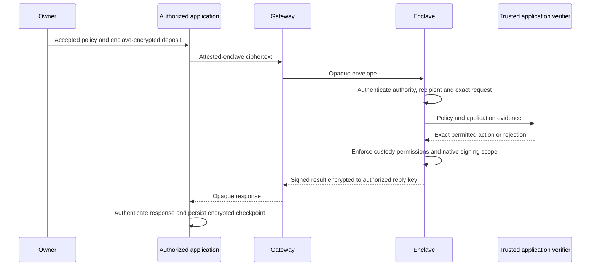

# Confidential authorization boundary

New escrow operations use `POST /api/v1/confidential` for the complete native protocol.
The authorized application orchestrates rounds. The gateway forwards bounded opaque envelopes.

## Visible data

The gateway sees enclave routing identifiers, independent opaque route identifiers, correlation identifiers, sizes, timing, and transport failures.
It does not receive plaintext policies, rosters, messages, transaction artifacts, invoices, receipts, or private native errors on this path.
Authorized participants know their inputs. The authorized application can decrypt the results needed to perform its work.
Encryption to the enclave does not protect application plaintext from an administrator of the application host.

Each request authenticates the complete native command, recipient key and epoch, routing header, request identity, and reply key.
The client obtains the recipient key through its configured attestation policy.
A deserialized journal cannot supply a replacement trusted enclave key.
Responses bind the exact request and carry the enclave signature inside reply-key encryption.
Detailed native errors use the same confidential channel.

The enclave suppresses private native-operation tracing, including spawned session workers.
Private values must not enter gateway logs, application metrics labels, or ordinary error strings.
A network relay can still observe destinations and traffic metadata.
Application HTTPS must terminate inside the enclave when its evidence requires enclave-authenticated transport.

## Permission and recovery boundaries

The participant signs the complete v2 policy before enrollment.
Authorization keys are independent of shared session decryption keys.
Signing permission, named-secret release, and signing-key release are distinct grants.
The verifier selects an exact action; the custody engine checks the action against the signed permission.

Applications persist private journals in authenticated encrypted storage before transmitting state-changing commands.
The journal includes original request ciphertexts, verified replies, signing item identifiers, and application recovery state.
The gateway must not store the plaintext journal.

Exact retries reuse the original command. Changed native nonce or partial-signature inputs fail the idempotency check.
The correlation identifier commits to the complete request with a private random blinding value.
It does not expose a policy or application digest.
The enclave verifies that commitment before consulting its bounded ciphertext cache.
Eviction removes cached ciphertext; native command history and escrow execution records still prevent repeated effects.
An obsolete signing-stage retry can fail after later stages complete. The application must checkpoint each response before advancing.
An authenticated rejection permits a new request identity when the application explicitly retries the failed operation.
A missing response does not prove rejection and cannot justify replacing the original request.

After restart, key custody can recover from the accepted encrypted registrations and pinned manifest.
Secret nonce state cannot recover from application storage.
Retain prepared application receipts so recovery does not repeat an external preparation, such as requesting another invoice.
Execution can restore an already prepared action from its authenticated sealed receipt.
The verifier's recovery hook restores related application authorization state before returning an already executed result.
Sealed receipts provide integrity, not global rollback resistance.

## Compatibility

Published legacy session and stored-key APIs remain available for existing clients.
Those APIs expose their historical metadata to the gateway and do not provide this confidential transport guarantee.
The enclave rejects legacy commands that reference a protected confidential session.
New generic escrow operations have no plaintext gateway endpoint.

The stock enclave registers no application verifier.
Unknown verifier identifiers and versions fail enrollment.
Application-owned measured images register the trusted code they require.
Verifier capability queries expose deployment descriptors and bounded capability data, never participant policy contents.
They are not an authenticated application-membership system.

See [Generic escrow](ESCROW.md) for the current protocol.
